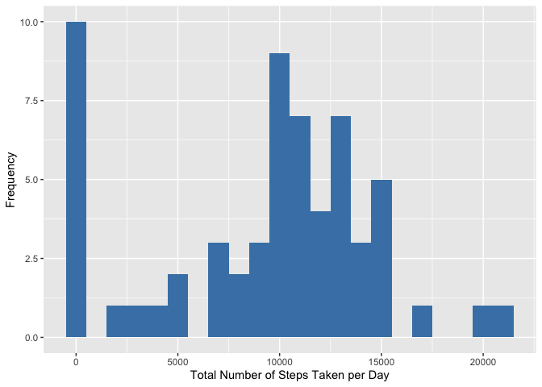

# Chen's first Rmarkdown
***

## Loading the essenstial package

```r
require(tidyverse)
```

```
## Loading required package: tidyverse
```

```
## ── Attaching packages ─────────────────────────────────────── tidyverse 1.3.1 ──
```

```
## ✓ ggplot2 3.3.5     ✓ purrr   0.3.4
## ✓ tibble  3.1.6     ✓ dplyr   1.0.8
## ✓ tidyr   1.2.0     ✓ stringr 1.4.0
## ✓ readr   2.1.2     ✓ forcats 0.5.1
```

```
## ── Conflicts ────────────────────────────────────────── tidyverse_conflicts() ──
## x dplyr::filter() masks stats::filter()
## x dplyr::lag()    masks stats::lag()
```

```r
require(scales)
```

```
## Loading required package: scales
```

```
## 
## Attaching package: 'scales'
```

```
## The following object is masked from 'package:purrr':
## 
##     discard
```

```
## The following object is masked from 'package:readr':
## 
##     col_factor
```

```r
require(ggpubr)
```

```
## Loading required package: ggpubr
```

```r
require(knitr)
```

```
## Loading required package: knitr
```
   
## Loading and preprocessing the data

```r
dt <- read_csv("activity.zip")
```

```
## Rows: 17568 Columns: 3
## ── Column specification ────────────────────────────────────────────────────────
## Delimiter: ","
## dbl  (2): steps, interval
## date (1): date
## 
## ℹ Use `spec()` to retrieve the full column specification for this data.
## ℹ Specify the column types or set `show_col_types = FALSE` to quiet this message.
```

## What is mean total number of steps taken per day?
The code below do these things:   
1. Group the data by **date**.   
2. Summarize the data with sum function, assign it to "**step1**".   
3. Plot "step1" with **ggplot2**.   
4. Report the **Mean & Median** of the total number of steps/day.

```r
step1 <- dt %>% group_by(date) %>% summarise(sum = sum(steps, na.rm = TRUE))

p1 <- ggplot(step1, aes(sum)) +
  geom_histogram(binwidth = 1000,fill="steelblue") +
  xlab("Total Number of Steps Taken per Day") +
  ylab("Frequency")
p1
```

<!-- -->

```r
cat("The Mean of the total number of steps/day is ", mean(step1$sum, na.rm = T),".", sep = "")
```

```
## The Mean of the total number of steps/day is 9354.23.
```

```r
cat("The Median of the total number of steps/day is ", median(step1$sum, na.rm = T),".", sep = "")
```

```
## The Median of the total number of steps/day is 10395.
```
   
   
## What is the average daily activity pattern?
The code below do these things:   
1. Group the data by **interval**.   
2. Summarize the data with **mean** function.   
3. Add a new column which present **24 hours a day**, assign it to "**step2**".   
4. Plot "step2" with **ggplot2**.   
5. Report which **interval** contains the maximum number of steps(on average).

```r
step2 <- dt %>% group_by(interval) %>%
  summarise(mean = mean(steps, na.rm = TRUE)) %>%
  mutate(time = seq(0,1435,5)/60)

p2 <- ggplot(step2,aes(x=time,y=mean)) + geom_line() +
  scale_x_continuous(breaks=seq(0, 24, 2)) +
  labs(x = "24 Hours a Day", y = "Average Number of Steps", title ="Average Daily Activity Pattern") +
  theme(plot.title = element_text(hjust = 0.5))
p2
```

<!-- -->

```r
cat("On average across all the days in the dataset ", step2[which.max(step2$mean),1][[1]], 
    " interval contains the maximum number of steps.", sep = "")
```

```
## On average across all the days in the dataset 835 interval contains the maximum number of steps.
```

## Imputing missing values
The code below do these things:   
1. Calculate and report the total number of **missing values** in the dataset.   
2. Devise a strategy for filling in all of the missing values in the dataset.   
3. Create a new dataset(**dt2**) that is equal to the original dataset but with the missing data filled in.   
4. Plot the new dataset and make a comparsion with raw data.   
5. Make a table to show the difference between new dataset and raw data.

```r
cat("The total number of missing values in the dataset is ", sum(is.na(dt)), ".",
    sep = "")
```

```
## The total number of missing values in the dataset is 2304.
```

```r
dt2 <- dt
dt2$steps <- unlist(map2(dt2$steps, dt2$interval, ~ if(is.na(.x)){step2[which(step2$interval==.y),2][[1]]} else .x))

step3 <- dt2 %>% group_by(date) %>% summarise(sum = sum(steps, na.rm = TRUE))

p3 <- ggplot(step3, aes(sum)) +
  geom_histogram(binwidth = 1000,fill="steelblue") +
  xlab("Total Number of Steps Taken per Day(Imputing missing values)") +
  ylab("Frequency")

p1_3 <- ggarrange(p1, p3, labels = c("A", "B"), ncol = 1, nrow = 2)
p1_3
```

<!-- -->

```r
miss_uf <- c(mean=mean(step1$sum, na.rm = T), median=median(step1$sum, na.rm = T))
miss_f <- c(mean=mean(step3$sum, na.rm = T), median=median(step3$sum, na.rm = T))
t1 <- bind_rows(miss_uf,miss_f)
row.names(t1) <- c("Raw Data", "Missing Data Filled")
```

```
## Warning: Setting row names on a tibble is deprecated.
```

```r
knitr::kable(t1, "simple")
```

                           mean     median
--------------------  ---------  ---------
Raw Data                9354.23   10395.00
Missing Data Filled    10766.19   10766.19

## Are there differences in activity patterns between weekdays and weekends?
The code below do these things:   
1. Create a new factor variable in the dataset with two levels – “weekday” and “weekend”.   
2. Group the data by **interval** & **weekday**.   
3. Make a panel plot containing a time series plot.   

```r
dt2$weekday <- as.factor(map_chr(dt2$date, ~ if(weekdays(.x) %in% c("Saturday", "Sunday")){"weekend"}else "weekday"))
summary(dt2)
```

```
##      steps             date               interval         weekday     
##  Min.   :  0.00   Min.   :2012-10-01   Min.   :   0.0   weekday:12960  
##  1st Qu.:  0.00   1st Qu.:2012-10-16   1st Qu.: 588.8   weekend: 4608  
##  Median :  0.00   Median :2012-10-31   Median :1177.5                  
##  Mean   : 37.38   Mean   :2012-10-31   Mean   :1177.5                  
##  3rd Qu.: 27.00   3rd Qu.:2012-11-15   3rd Qu.:1766.2                  
##  Max.   :806.00   Max.   :2012-11-30   Max.   :2355.0
```

```r
step4 <- dt2 %>% group_by(interval, weekday) %>%
  summarise(mean = mean(steps, na.rm = TRUE))
```

```
## `summarise()` has grouped output by 'interval'. You can override using the
## `.groups` argument.
```

```r
p4 <- ggplot(step4,aes(x=interval,y=mean)) + geom_line() +
  scale_x_continuous(breaks=seq(0, 2400, 200)) +
  facet_grid(rows = vars(weekday)) +
  labs(x = "Interval", y = "Number of Steps", title ="Daily Activity Pattern") +
  theme(plot.title = element_text(hjust = 0.5))
p4
```

<!-- -->
